











Plain text version

## Hi, I'm Jérémie Nunez

### Exploring the space between artificial intelligence, software systems, and human reasoning.

I am deeply interested in how intelligent systems can help people think better, build faster, and interact with technology in more natural ways.

For me, software is not just about creating applications.  
It is about designing tools that extend human capability.

I am fascinated by the moment where an idea becomes a system — where abstract thinking turns into something useful, scalable, and alive.

### Artificial Intelligence

I am interested in AI not only as a technology, but as a new way to design software. I like exploring how AI systems can reason, assist, automate, explain, and collaborate with humans.

AI agents · Large language models · Human-AI collaboration · Autonomous workflows · Reasoning systems · Conversational interfaces · Voice-based AI · Machine learning applied to real products

### Human Reasoning

One of the things that interests me most is how humans think, decide, learn, and solve problems.

- How do people make decisions?
- How can software reduce cognitive load?
- How can AI help humans think more clearly?
- How can complex systems become easier to understand?
- How can technology make people more capable instead of more dependent?

I believe the best tools do not replace thinking. They improve it.

### Software Architecture

I enjoy designing systems that are clean, scalable, and understandable. Good architecture feels almost invisible. When it is done well, the product feels simple, even if the system behind it is complex.

Clear abstractions · Scalable backends · Reliable APIs · Developer experience · System design · Performance · Maintainability · Elegant technical decisions

I like software that is not only functional, but well thought out.

### Machine Learning

I am interested in machine learning as a bridge between data, behavior, and intelligence. What excites me is not only training models, but understanding how ML can become part of useful products.

Practical ML systems · Model behavior · Personalization · Pattern recognition · Intelligent automation · ML-powered user experiences · Turning experiments into usable tools

### Voice & Natural Interfaces

I believe the way we interact with software is changing. Typing, clicking, and navigating menus are not always the most natural ways to use technology. That is why I am interested in voice interfaces, conversational agents, and systems that feel closer to human interaction.

The future of software may not only be visual. It may be conversational, adaptive, and context-aware.

### Systems That Create Leverage

I am drawn to tools that multiply what a person can do: software that saves time, clarifies decisions, automates repetitive work, helps people learn faster, makes complex tasks easier, turns knowledge into action, and gives individuals more power to create.

To me, the most exciting products are not just convenient. They change what people are capable of doing.

### How I Think About Technology

Technology should not feel like noise. It should feel like leverage.

I am interested in building systems that are intelligent but understandable, powerful but simple to use, scalable but maintainable, automated but human-centered, technical but meaningful.

